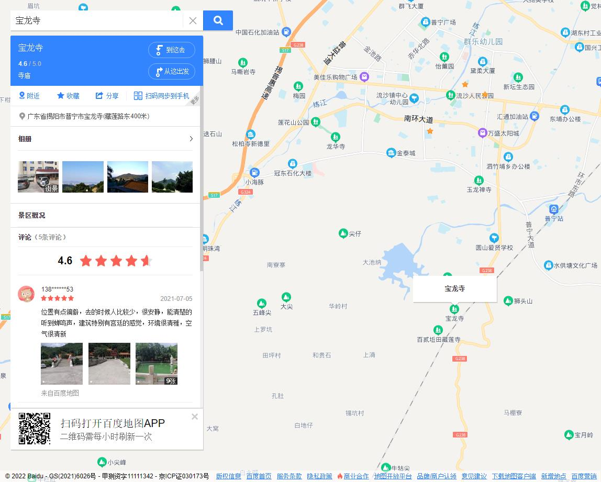

# Grandma
谨以此GIT项目纪念我的外婆，璀璨人类文明中不可或缺的一环🌏🚀  

  
公历1934年7月11日 农历甲戌年五月三十卯时出生  
公历2022年6月5日 农历壬寅年五月初七未时往生极乐🙏🏻🙏🏻🙏🏻  

## 宝龙寺

广东省揭阳市普宁市宝龙寺(藏莲路东400米) 功德堂 右厅 9行 13号

## 文件下载
外婆住院账、圆满账、纸礼记录原文档如下备查，所有文档均已加密，查看密码为外婆全名拼音(全拼小写)：  
1. [住院账本流水](外婆住院-流水-20220619.xls)  
2. [圆满账本流水](人生圆满-流水-20220622.xls)  
3. [纸礼明细](人生圆满(儿女+儿女亲朋+世交纸礼明细).xlsx)  
4. [悼母亲致谢词](悼母亲致谢词.docx)  
  

## 本项目其他存档  
- https://gitee.com/wbb/grandma (匿名访问)
- https://github.com/kxjhwbb/grandma (匿名访问)
- https://git.weixin.qq.com/wbb/grandma (公开访问,需要登录微信开发者账号)
- https://code.aliyun.com/kxjhwbb/grandma (公开访问,需要登录阿里云账号)

## 项目存档克隆
存档可直接访问，或完整克隆至本地，需要安装GIT
```
git clone https://gitee.com/wbb/grandma.git
```
